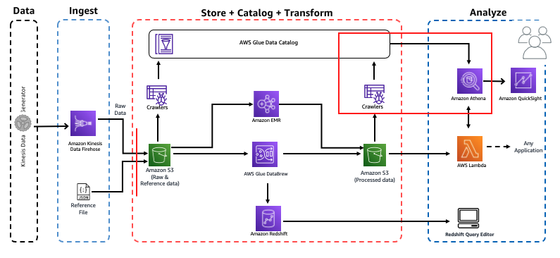

# Workshop: Analytics on AWS

Contributors:

* Vikas Omer | Amazon Web Services | [LinkedIn](https://www.linkedin.com/in/vikas-omer/)
* Aneesh Chandra PN | Amazon Web Services | [LinkedIn](https://www.linkedin.com/in/aneesh-chandra-pn/)



# Pre-requisites:
Complete the previous modules:  
* Ingest and Storage [link](../modules/ingest.md)
* Catalog Data [link](../modules/catalog.md)
* Transform Data with AWS Glue [link](../modules/transform_glue.md)


# Analyze 

## Explore transformed data using Athena

In this step we will analyze the transformed data using Amazon Athena. 

Login to the Amazon Athena Console.

* Go to: https://console.aws.amazon.com/athena/home?region=us-east-1#query
* As Athena uses the AWS Glue catalog for keeping track of data source, any S3 backed table in Glue will be visible to Athena.
* On the left panel, select '**analyticsdemodb**' from the dropdown
* Run the following query: 
    ```
    SELECT artist_name,
           count(artist_name) AS count
    FROM processed_data
    GROUP BY artist_name
    ORDER BY count desc
    ```

* Explore the Athena UI and try running some queries. Try querying the `emr_processed_data` table.
* This query returns the list of tracks repeatedly played by devices. Later, we will visualize this query using QuickSight:
    ````
    SELECT device_id,
           track_name,
           count(track_name) AS count
    FROM processed_data
    GROUP BY device_id, track_name
    ORDER BY count desc
    ````

Back to [main page](../readme.md)