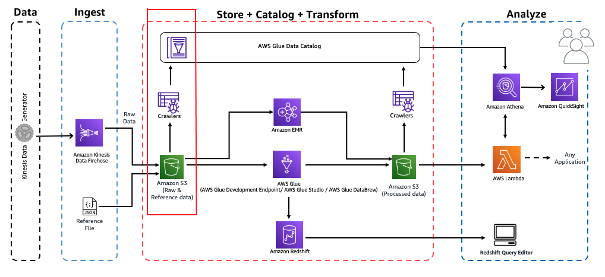

# Workshop: Analytics on AWS

Contributors:

* Vikas Omer | Amazon Web Services | [LinkedIn](https://www.linkedin.com/in/vikas-omer/)
* Aneesh Chandra PN | Amazon Web Services | [LinkedIn](https://www.linkedin.com/in/vikas-omer/)



# Pre-requisites:  
* Complete the previous module:   
    * Ingest and Storage [link](../modules/ingest.md)

# Catalog Data

## Create IAM Role

In this step we will navigate to the IAM Console and create a new AWS Glue service 
role. This allows AWS Glue to access the data stored in S3 and to create the 
necessary entities in the Glue Data Catalog.

* Go to: https://console.aws.amazon.com/iam/home?region=us-east-1#/roles
* Click **Create role**
    * Choose the service that will use this role: **Glue**
    * Click **Next: Permissions**
    * Search for **AmazonS3FullAccess**
        * Select the entry's **checkbox**
    * Search for **AWSGlueServiceRole**
        * Select the entry's **checkbox**
    * Click **Next: Tags**
	    * Optionally add Tags, e.g.:
            * Demo: AnalyticsOnAWS
    * Click **Next: Review**
    * Role name: **AnalyticsDemoGlueRole**
    * Make sure that only two policies attached to this role (**AmazonS3FullAccess**, **AWSGlueServiceRole**)
    * Click **Create role**

## Create AWS Glue Crawlers

In this step, we will navigate to AWS Glue Console & create glue crawlers to discovery the newly ingested data in S3.

* Go to: https://console.aws.amazon.com/glue/home?region=us-east-1
* On the left panel, click on **Crawlers** > Click on **Add Crawler**
    * Crawler info
        * Crawler name: **AnalyticsDemoCrawler**
        * Optionally add Tags, e.g.:
            * Demo: AnalyticsOnAWS
        * Click **Next**
    * Select **Data stores**
    * Click **Next**
    * Choose a Data Store:
        * Data store: **S3**
        * Crawl data in: **Specified path in my account**
        * Include path: **s3://yourname-analytics-demo-bucket/data/**
        * Click **Next**
        * Add another data store: **No**
        * Click **Next**
    * IAM Role
        * Select: **Choose an existing IAM role**
        * Role Name: **AnalyticsDemoGlueRole**
        * Click **Next**
    * Schedule
        * Frequency: **Run on demand**
        * Click **Next**
    * Output
        * Click **Add database**
        * Database name: **analyticsdemodb**
        * Click **Create**
        * Click **Next**
    * Review all steps
        * Review the configuration & make sure its as mentioned above
        * Click **Finish**
* You should see this message: "Crawler analyticsdemodb was created to run on demand."
    * Select the crawler's checkbox
    * Click **Run on demand** to run the crawler for the first time
    * Wait for few minutes

## Verify newly created tables in catalog

Navigate to Glue Catalog and explore the crawled data:

* Go to: https://console.aws.amazon.com/glue/home?region=us-east-1#catalog:tab=databases 
    * Click **analyticsdemodb**
* Click **Tables in analyticsdemodb**
    * Click **raw**
    * Look around and explore the schema for your dataset
        * look for the `averageRecordSize`, `recordCount`, `compressionType`

## Query ingested data using Amazon Athena

Let's query the newly ingested data using Amazon Athena

* Go to: https://us-east-1.console.aws.amazon.com/athena/home?region=us-east-1#query
* If necessary, click **set up a query result location in Amazon S3** in the blue alert near the top of the Athena console
    * Enter s3://yourname-analytics-demo-bucket/query_results/
    * Click **Save**
* On the left panel (**Database**) drop down , select **analyticsdemodb** > select table **raw**
* Click on **3 dots** (3 vertical dots) > Select **Preview Table**
* Review the output 
* In query editor, paste the following query:
    ```
    SELECT activity_type,
             count(activity_type)
    FROM raw
    GROUP BY  activity_type
    ORDER BY  activity_type
    ```
* Click on **Run Query**


Back to [main page](../readme.md)