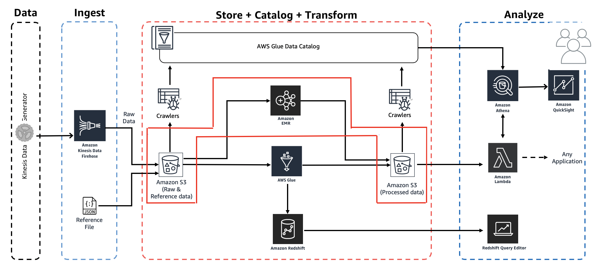

# Workshop: Analytics on AWS

Contributors:

* Vikas Omer | Amazon Web Services | [LinkedIn](https://www.linkedin.com/in/vikas-omer/)
* Aneesh Chandra PN | Amazon Web Services | [LinkedIn](https://www.linkedin.com/in/aneesh-chandra-pn/)

### Pre-requisites:  

Complete the previous modules:  
* Ingest and Storage [link](../modules/ingest.md)
* Catalog Data [link](../modules/catalog.md)

## Transform Data with EMR

### Copy the script to S3

In this step, we will navigate to S3 Console and create couple of folders to be used for the EMR step.

* Go to: https://s3.console.aws.amazon.com/s3/home?region=us-east-1
* Add the PySpark script:
    * Open **yourname-analytics-demo-bucket**
        * Click **Create folder**
            * Create a new folder called **scripts**
            * Click **Save**
    * Open **scripts**
        * Download this file locally: [emr_pyspark.py](../scripts/emr_pyspark.py)
        * In the S3 console, click **Upload**:
            * Click **Add files** and upload the **emr_pyspark.py** file you just downloaded
            * Click **Upload** (bottom left)

* Create a folder for EMR logs:
    * Open **yourname-analytics-demo-bucket**
        * Click **Create folder**
            * Create a new folder called **logs**
            * Click **Save**

### Create EMR cluster and add step

In this step, we will create a EMR cluster and submit a Spark step.

* Go to to the EMR console: https://console.aws.amazon.com/elasticmapreduce/home?region=us-east-1#
* Click on **Create cluster**
* Continue with **Create cluster - Quick options**
    * Provide a name for the cluster: **analytics-demo-transformer**
    * Check the **Logging** option and provide the S3 folder:
        * s3://**yourname-analytics-demo-bucket/logs/**
    * Change the **Launch mode** to **Step execution**
    * Under _Add steps_ select **Spark application** from the drop down 
        * Click on **Configure**
        * In the popup window, leave the **Spark-submit options** as blank
        * For the Application location, select the location to the script that was previously uploaded - 
        **s3://yourname-analytics-demo-bucket/scripts/emr_pyspark.py**
        * Click on **Select**
        * Under **Arguments**, enter the name of your s3 bucket **yourname-analytics-demo-bucket**
        * For _Action on failure_, select **Terminate cluster** from the drop down
        * Click on **Add** to complete
         
            
    
    * Leave the **Use AWS Glue Data Catalog for table metadata** option **unchecked**
    * Confirm the Security configuration is set to 
        * Release: **emr-x.x**
        * Applications: Hadoop x.x.x, Spark x.x.x
        * The versions here will be set to the latest version by default        
    * Confirm the Hardware configuration defaults are 
        * Instance type: **m5.xlarge**
        * Number of Instances: 3 (1 master and 2 core nodes)
    * Leave the Security and access configurations to **default**
    * Click on **Create cluster** to complete. 

### Check the status of the Transform Job run on EMR

* The EMR cluster will take 6-8 minute to get provisioned, and another minute or so to complete the Spark step execution.
* The Cluster will be terminated after the Spark job has been executed.
* To check the status of the job, click on the Cluster name: **analytics-demo-transformer**
    * Go to the **Steps** tab
    * Here you should see two items: **Spark application** and **Setup hadoop debugging**
    * The status of the **Spark application** should change from _Pending_ to _Running_ to _Completed_
    
    
    
    * Once the Spark job run is complete the EMR cluster will be terminated
    * Under EMR > Cluster, you will see the Status of the cluster as **Terminated** with **All steps completed** message.
    
    
    
> In case of any issues in executing the Spark job, you will see the Status of the cluster as **Terminated with errors (Step failure)**. In case of failures, you can browse through the EMR logs to understand the root cause of the job failure

### Validate - Transformed / Processed data has arrived in S3

Let's go ahead and confirm that the EMR transform job has created the data set in the S3 console: https://s3.console.aws.amazon.com/s3/home?region=us-east-1

* Click - **yourname-analytics-demo-bucket > data**
* Open the new folder **emr-processed-data**:
    * Ensure that .parquet files are created in this folder.

### Rerun the Glue Crawler

* Go to: https://console.aws.amazon.com/glue/home?region=us-east-1
* On the left panel, click on **Crawlers** 
    * Select the crawler created in the previous module: **AnalyticsDemoCrawler**
        * Click on **Run crawler**
    
* You should see the Status change to **Starting**.
    * Wait for few minutes for the crawler run to complete
    * The crawler to display the **Tables added** as 1

You can go to the databases section on the left and confirm that **emr_process_data** table has been added.

> Back to [main page](../readme.md)