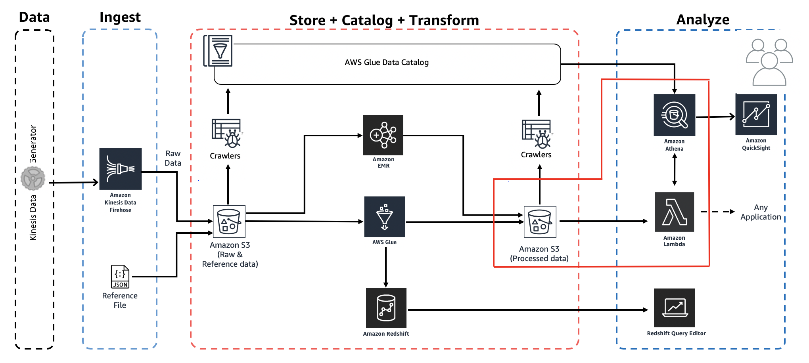

# Workshop: Analytics on AWS

Contributors:

* Vikas Omer | Amazon Web Services | [LinkedIn](https://www.linkedin.com/in/vikas-omer/)
* Aneesh Chandra PN | Amazon Web Services | [LinkedIn](https://www.linkedin.com/in/aneesh-chandra-pn/)



# Pre-requisites:  
Complete the previous modules:
* Ingest and Storage [link](../modules/ingest.md)
* Catalog Data [link](../modules/catalog.md)
* Transform Data with AWS Glue [link](../modules/transform_glue.md)

# Lambda

Let's create a Lambda Function which will host the code for Athena to query and fetch Top 5 Popular Songs by Hits from processed data.

* Go to: https://console.aws.amazon.com/lambda/home?region=us-east-1
  * **Note:** Make sure Region is selected as **US East (N. Virginia)** which is us-east-1
* Click **Create function** (if you are using Lambda for the first time, then you might have to click Get Started to proceed)
* Select **Author from scratch**
* Under **Basic Information**:
  * Give Function name as **AnalyticsDemo_top5Songs**
  * Select Runtime as **Python 3.8**
  * Expand **Choose or create an execution role** under Permissions, make sure **Create a new role with basic Lambda permissions** is selected.
* Click **Create Function**

## Author Lambda Function

In this section, we will provide code to the lambda function which we just created. We will use `boto3` to access Athena client. 

> Boto is the Amazon Web Services (AWS) SDK for Python. It enables Python developers to create, configure, and manage AWS services, such as EC2 and S3. Boto provides an easy to use, object-oriented API, as well as low-level access to AWS services. Read more about Boto here - https://boto3.amazonaws.com/v1/documentation/api/latest/index.html?id=docs_gateway
>
> Read more about Boto3 Athena API methods here - https://boto3.amazonaws.com/v1/documentation/api/latest/reference/services/athena.html

### Function Code

* Scroll down to Function Code section and replace existing code under in `lambda_function.py` with the python code below:

  ```python
  import boto3
  import time
  import os
  
  # Environment Variables
  DATABASE = os.environ['DATABASE']
  TABLE = os.environ['TABLE']
  # Top X Constant
  TOPX = 5
  # S3 Constant
  S3_OUTPUT = f's3://{os.environ["BUCKET_NAME"]}/query_results/'
  # Number of Retries
  RETRY_COUNT = 10
  
  def lambda_handler(event, context):
      client = boto3.client('athena')
      # query variable with two environment variables and a constant
      query = f"""
          SELECT track_name as \"Track Name\", 
                  artist_name as \"Artist Name\",
                  count(1) as \"Hits\" 
          FROM {DATABASE}.{TABLE} 
          GROUP BY 1,2 
          ORDER BY 3 DESC
          LIMIT {TOPX};
      """
      response = client.start_query_execution(
          QueryString=query,
          QueryExecutionContext={ 'Database': DATABASE },
          ResultConfiguration={'OutputLocation': S3_OUTPUT}
      )
      query_execution_id = response['QueryExecutionId']
      # Get Execution Status
      for i in range(0, RETRY_COUNT):
          # Get Query Execution
          query_status = client.get_query_execution(
              QueryExecutionId=query_execution_id
          )
          exec_status = query_status['QueryExecution']['Status']['State']
          if exec_status == 'SUCCEEDED':
              print(f'Status: {exec_status}')
              break
          elif exec_status == 'FAILED':
              raise Exception(f'STATUS: {exec_status}')
          else:
              print(f'STATUS: {exec_status}')
              time.sleep(i)
      else:
          client.stop_query_execution(QueryExecutionId=query_execution_id)
          raise Exception('TIME OVER')
      # Get Query Results
      result = client.get_query_results(QueryExecutionId=query_execution_id)
      print(result['ResultSet']['Rows'])
      # Function can return results to your application or service
      # return result['ResultSet']['Rows']
  ```

### Environment Variables

> Environment variables for Lambda functions enable you to dynamically pass settings to your function code and libraries, without making changes to your code. Read more about Lambda Environment Variables here - https://docs.aws.amazon.com/lambda/latest/dg/env_variables.html

* Scroll down to **Environment variables** section and add below two Environment variables.
  * Key: **DATABASE**, Value: **analyticsdemodb**
  * Key: **TABLE**, Value: **processed_data**
  * Key: **BUCKET_NAME**, Value: **yourname-analytics-demo-bucket**
* Leave the **Memory (MB)** as default which is 128 MB
* Change **Timeout** to 10 seconds.
* Optionally add Tags, e.g.:
    * Demo: AnalyticsOnAWS
* Click **Save**

### Execution Role

* Select the **Permissions** section:
  * Click the Role Name link under **Execution Role** to open the IAM Console in a new tab.
* Click **Attach policies**
* Add the following two policies (search in filter box, check and hit Attach policy):
  * AmazonS3FullAccess
  * AmazonAthenaFullAccess
* Once these policies are attached to the role, close this tab.

## Configuring The Test Event

Our function is now ready to be tested. Let's configure a dummy test event to see execution results of our newly created lambda function.

* Click **Test** on right top hand corner of the lambda console.
* A new window will pop up for us to configure test event.
  * **Create new test event** is selected by default.
  * Event template: **Hello World**
  * Event name: **Test**
  * Leave everything as is
  * Click **Create**
* Click **Test** again
* You should be able to see the output in json format under **Execution Result** section.

## Verification through Athena

Let's verify the results through Athena

* Go to: https://console.aws.amazon.com/athena/home?region=us-east-1#query
* As Athena uses the AWS Glue catalog for keeping track of data source, any S3 backed table in Glue will be visible to Athena.
* On the left panel, select **analyticsdemodb** from the dropdown
* Run the following query:
  ```sql
  SELECT track_name as "Track Name",
      artist_name as "Artist Name",
      count(1) as "Hits" 
  FROM analyticsdemodb.processed_data 
  GROUP BY 1,2 
  ORDER BY 3 DESC 
  LIMIT 5;
  ```
* Compare the results of this query with the results of lambda function; they should be identical.

### GREAT! 

### You have now created a lambda function from scratch and tested it.

Back to [main page](../readme.md)