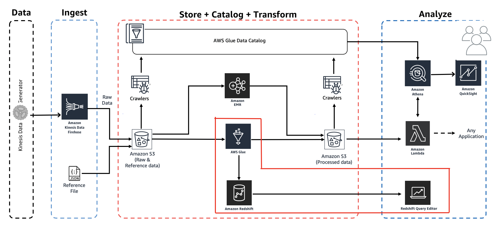
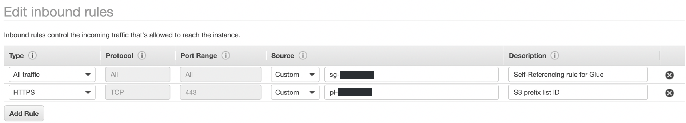
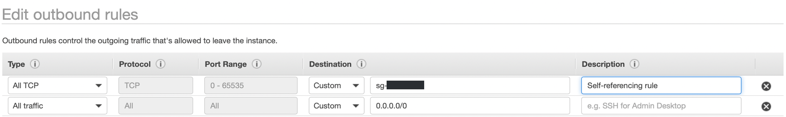

# Workshop: Analytics on AWS

Contributors:

* Vikas Omer | Amazon Web Services | [LinkedIn](https://www.linkedin.com/in/vikas-omer/)
* Aneesh Chandra PN | Amazon Web Services | [LinkedIn](https://www.linkedin.com/in/aneesh-chandra-pn/)



### Pre-requisites:  

Complete the previous modules:
* Ingest and Storage [link](../modules/ingest.md)
* Catalog Data [link](../modules/catalog.md)

### Create Redshift IAM Role

In this step we will create an IAM role for Redshift cluster.

* Go to: https://console.aws.amazon.com/iam/home?region=us-east-1#/roles
	* Click on **Create role**
	* Select **Redshift**
	* Select **Redshift - customizable** under **Select your use case**
	* Click **Next: Permissions**
	* In Search box, search and check following two policies
		* **AmazonS3FullAccess**
		* **AWSGlueConsoleFullAccess**
	* Click **Next: Tags**
	    * Optionally add Tags, e.g.:
            * Demo: AnalyticsOnAWS
	* Click **Next: Review**
	* Give **Role Name** as **AnalyticsDemo_RedshiftRole**
	* Verify following two policies are attached to the role:
		* **AmazonS3FullAccess**
		* **AWSGlueConsoleFullAccess**
	* Click **Create role**

> Read More about Associating IAM Roles with Redshift cluster here: https://docs.aws.amazon.com/redshift/latest/mgmt/copy-unload-iam-role.html

### Create Redshift cluster

In this step, you will be creating a 2 node Redshift cluster to create a mini star schema database.

* Go to: https://console.aws.amazon.com/redshiftv2/home?region=us-east-1
* Click **Create Cluster**
* Leave **Cluster identifier** as **redshift-cluster-1**
* Select **dc2.large** as **Node Type**
* Select Number of Nodes as **2**. 
* Verify **Configuration summary**.
* Leave **Database port (optional)** as **5439**
* Change **Master user name** to **admin**
* Enter **Master user password**. 
    * Check the password rules mentioned below the Master user password before choosing a password. (***This password will be used for accessing the cluster***)
* Expand **Cluster permissions (optional)**
    * Select previously created **AnalyticsDemo_RedshiftRole** from the drop down menu.
    * Click **Add IAM role**
    * **AnalyticsDemo_RedshiftRole** should appear under **Attached IAM roles**
* Leave **Additional configurations** to default. It uses default VPC and default security group by default
* Click **Create Cluster**
	
*It will take a few minutes for the cluster to move into the `available` state*. 	
**Once the cluster has come up and is in Available state, move to the next step.**

### Create S3 Gateway Endpoint

In this step, we will create S3 Gateway Endpoint so that Redshift cluster can communicate with S3 using its private IP. 

>Read more about Amazon Virtual Private Cloud (VPC) here: https://docs.amazonaws.cn/en_us/vpc/latest/userguide/what-is-amazon-vpc.html

>Read more about S3 Gateway Endpoints here: https://docs.aws.amazon.com/vpc/latest/userguide/vpc-endpoints-s3.html

* Go to: https://console.aws.amazon.com/vpc/home?region=us-east-1#Endpoints:sort=vpcEndpointId
* Click **Create Endpoint**
* Select **AWS Services** under **Service category** (which is the default selection)
* Under **Service name** search box, search for "**s3**" and hit enter/return.
* **com.amazonaws.us-east-1.s3** should come up as search result. Select this option.
* Under **VPC**, chose default VPC. *This is the same VPC which was used for configuring redshift cluster*. 
    *If you have more than VPC listed in the drop down list, double check Redshift VPC to avoid any confusion. Do the following:
        * Go to: https://console.aws.amazon.com/redshiftv2/home?region=us-east-1  
        * Click on **redshift-cluster-1**
        * Click on **Properties** tab.
        * Scroll down and check **Network and security** section for VPC name.
* Once you have double checked VPC id, move to **Configure route tables** section.
* Select the listed route table (this should be the main route table). You can verify this by checking **Yes** under **Main** column.

Note the **com.amazonaws.us-east-1.s3** id listed against **Configure route tables**. It should start with pl-[some number]

* Leave **Policy** as default. (**Full Access**)
* Click **Create endpoint**.

*It should take a couple of seconds to provision this. Once this is ready, you should see **Status** as **available** against the newly created S3 endpoint.*

* Edit the name of the endpoint and make it **RedshiftS3EP**

### Verify and add rules to the default security group 

In this step, you will verify and add rules to the Redshift security group so that Glue service can talk to Redshift. 

* Go to: https://console.aws.amazon.com/vpc/home?region=us-east-1#SecurityGroups:sort=tag:Name
* Select the Redshift security group. It should be the default security if it was not changed during the Redshift cluster creation step. 
    * If you have more than one security group in the list, follow the below step:
        * Go to: https://console.aws.amazon.com/redshiftv2/home?region=us-east-1  
        * Click on **redshift-cluster-1**
        * Click on **Properties** tab.
        * Scroll down and check **Network and security** section for Security Group id.
* Once you have verified the Security Group, select the security group (check box at the beginning of the row). 
* Click **Inbound Rules**.
	* Click **Edit rules**
	* Check if a self-referencing rule exists. (This should be available by default but if not add a rule as listed below)
        |Type|Source|
        |-----|-----|
        |All Traffic|[Name of the same security group which you are editing]|
        *Note* : A self-referencing rule is required for Glue components to communicate.
	* Add **HTTPS** rule for Amazon S3 access.
        |Type|Source|
        |-----|-------------|
        |HTTPS|[s3-prefix-list-id]|
        
        
	
	    *Note* : Under **Source** select Custom and type "pl" into the textbox beside it, the previously created S3 endpoint will show up and select it.
	* Click **Save rules**.
* Click **Outbound Rules**.
  * Click **Edit rules**
  * Leave existing rule as-is which has the following values:
      |Type|Source|
      |-----|-------------|
      |All Traffic|0.0.0.0/0|
  * Add a self-referencing rule. (This should be available by default but if not add a rule as listed below)
      |Type|Source|
      |-----|-------------|
      |All TCP|[Name of the same security group which you are editing]|

      *Note* : A self-referencing rule is required for Glue components to communicate.
      
      
      
  * Click **Save rules**.

>Read more on setting up VPC for Glue access here: https://docs.aws.amazon.com/glue/latest/dg/setup-vpc-for-glue-access.html

### Create Redshift connection under Glue Connection.

In this step, we will create a Redshift Connection under Glue connection which we can use in Development Endpoint to establish a connection to Redshift.

* Go to: https://us-east-1.console.aws.amazon.com/glue/home?region=us-east-1#catalog:tab=connections
	* Click **Add Connection**
		* Give **Connection name** as **analytics_demo**.
		* Choose **Connection type** as **Amazon Redshift**.
		* Click **Next**
	* Setup access to your data store:
		* Choose **Cluster** as **redshift-cluster-1**
		* Database name and Username should get populated automatically as Dev and admin respectively.
		* **Password**: Enter the password which you have used during Redshift cluster setup.
		* Click **Next**
	* Review connection details and click **Finish**.
	* Let's test the connection:
		* Select the connection **analytics_demo**.
		* Click **Test Connection**
		* Select the Glue role which was created in module **Catalog Data** [link](../modules/catalog.md) i.e. **AnalyticsDemoGlueRole**
		* Click **Test Connection**
	
This process will take a few moments. Successful connection should display the following message: "**analytics_demo connected successfully to your instance.**"

### Create schema and redshift tables.

* Go to: https://us-east-1.console.aws.amazon.com/redshiftv2/home?region=us-east-1#query-editor
* Execute the queries below to create schema and tables for raw and reference data.
* Enter the appropriate database connection details
* Click **Connect**

```sql
--	Create redshift_lab schema.
CREATE schema redshift_lab;
```

```sql
--	Create f_raw_1 table.
CREATE TABLE IF not EXISTS redshift_lab.f_raw_1 (
  uuid			varchar(256),
  device_ts 		timestamp,
  device_id		int,
  device_temp		int,
  track_id		int,
  activity_type		varchar(128),
  load_time		int
);
```

```sql
--	Create d_ref_data_1 table.
CREATE TABLE IF NOT EXISTS redshift_lab.d_ref_data_1 (
  track_id		int,
  track_name	varchar(128),
  artist_name	varchar(128)
);
```

## Transform and load data into Redshift

### Create Glue Development Endpoint
In this step, you will be creating a Glue Dev Endpoint to interactively develop Glue ETL scripts using PySpark

* Go to: https://console.aws.amazon.com/glue/home?region=us-east-1#etl:tab=devEndpoints
* Click **Add endpoint**:
  * Development endpoint name: **analyticsDemoEndpoint2**
    * IAM role: **AnalyticsDemoGlueRole**
    * Expand **Security configuration.. parameters**
      * Data processing units (DPUs): **2** (this reduces the cost of the running this lab)
    * Optionally add Tags, e.g.:
      * Demo: AnalyticsOnAWS
  * Click **Next**
  * Networking screen:
    * Select **Choose a connection**
    * Pick **analytics_demo**
    * Click **Next**
  * Add an SSH public key (Optional)
    * Leave as defaults
    * Click: **Next**
  * Review the settings
    * Click: **Finish**

It will take close to 10 minutes for the new Glue development endpoint to spin up.

**You have to wait for this step to complete before moving to next step.**

### Create SageMaker Notebooks (Jupyter) for Glue Dev Endpoints

* Go to: https://console.aws.amazon.com/glue/home?region=us-east-1#etl:tab=notebooks
* Select tab: **Sagemaker notebooks**
* Click **Create notebook**
  * Notebook name: **AnalyticsDemoRedshiftNotebook**
  * Attach to development endpoint: **analyticsDemoEndpoint2**
  * Select **Choose an existing role**
  * IAM Role: **AnalyticsDemoNotebookRole**
  * VPC (optional): Leave blank
  * Encryption key (optional): Leave blank
  * Optionally add Tags, e.g.:
      * Demo: AnalyticsOnAWS
  * Click: **Create Notebook**

This will take few minutes, wait for this to finish.

### Launch Jupyter Notebook
* Download and save this file locally on your laptop: [analytics-demo-redshift-notebook.ipynb](../analytics-demo-redshift-notebook.ipynb)
* Go to: https://console.aws.amazon.com/glue/home?region=us-east-1#etl:tab=notebooks
* Click **AnalyticsDemoRedshiftNotebook**
* Click **Open** to open the notebook in a new tab
* In the Sagemaker Jupyter Notebook:
  * Click **Upload** (right top part of screen)
  * Browse and upload **analytics-demo-redshift-notebook.ipynb** which you downloaded earlier
  * Click **Upload** to confirm the download
  * Click on **analytics-demo-redshift-notebook.ipynb** to open the notebook
  * Make sure it says **'Sparkmagic (PySpark)'** on top right part of the notebook, this is the name of the kernel Jupyter will use to execute code blocks in this notebook
  
  **Follow the instructions on the notebook**
  
  * Read and understand the instructions, they explain important Glue concepts

### Validate - Transformed / Processed data has arrived in Redshift. 	

Once the ETL script has ran successfully, Go to the Redshift Query Editor: https://us-east-1.console.aws.amazon.com/redshiftv2/home?region=us-east-1#query-editor

* Execute the following queries to check the number of records in raw and reference data table.

  ```sql
  select count(1) from redshift_lab.f_raw_1;
  
  select count(1) from redshift_lab.d_ref_data_1;
  ```

### Some queries to try

```sql
select 
  track_name, 
  artist_name, 
  count(1) frequency
from 
  redshift_lab.f_raw_1 fr
inner join 
  redshift_lab.d_ref_data_1 drf
on 
  fr.track_id = drf.track_id
where 
  activity_type = 'Running'
group by 
  track_name, artist_name
order by 
  frequency desc
limit 10;
```

# WELL DONE! 

### You have successfully loaded data from S3 to Redshift using Glue serverless ETL. 

If you want to learn a bit more about Amazon Redshift, follow the below optional section


## OPTIONAL SECTION

### Best Practices on Redshift

In this step, you will implement some of the Redshift best practices to optimize 
storage and performance of the cluster based on queries that hit the Redshift 
cluster. The previous section shows a typical query from consumers of data.

***While most of the steps you will go through are automated within Redshift but it's always good to understand the key concepts and how they work.***

* Use the Redshift query editor to execute the queries in the next steps:
  * Go to: https://us-east-1.console.aws.amazon.com/redshiftv2/home?region=us-east-1#query-editor

### String column size

* Check maximum length of string based columns. 
    * *All string based columns should be allocated not more than required precision. It helps reduce storage on the cluster and also improves query performance when you use these columns in query by consuming less memory*.
        ```sql
        select max(len(uuid)) as uuid_len, max(len(activity_type)) as activity_type_len from redshift_lab.f_raw_1;
        
        select max(len(track_name)) as uuid_len, max(len(artist_name)) as activity_type_len from redshift_lab.d_ref_data_1;
        ```
* Results from above query will be used in determining new precision for string based columns. 
  * *Genrally, a buffer is maintained while defining column precisions or column precision can be fixed, if its a standard attribute where column precision is known. Example: A Fully Qualified Domain Name*

Read more about limiting column sizes here: https://docs.aws.amazon.com/redshift/latest/dg/c_best-practices-smallest-column-size.html

### Compression

In this step, we will analyze raw table for compression.   

* Check appropriate encoding algorithm on each of the tables to implement compression.
    * *Compression is a column-level operation that reduces the size of data when it is stored. Compression conserves storage space and reduces the size of data that is read from storage, which reduces the amount of disk I/O and therefore improves query performance*.
	* Lets focus on fact table **f_raw_1**
    ```sql
    analyze compression redshift_lab.f_raw_1;
    ```

Results from above table provides the following info for each of the columns:

* Columns		
  * **Encoding** : Recommended encoding based on column precision type and values.
  * **Est_reduction_pct** Estimated reduction percentage if the recommended encoding is implemented.

**Note**: Do not encode/compress sort keys. Highly compressed sort keys mean many rows per block which in turn means more blocks are scanned than needed. 

>Read more on Redshift compression here: https://docs.aws.amazon.com/redshift/latest/dg/t_Compressing_data_on_disk.html

>Read more on automatically enabling compression while loading data into Redshift here: https://docs.aws.amazon.com/redshift/latest/dg/c_Loading_tables_auto_compress.html

### Distribution Style

* Use **KEY** based distribution for the fact table **f_raw_1**.
  * Since the two tables (**f_raw_1** and **d_ref_data_1**) need to be joined on **track_id** column, chose **track_id** as the distribution key. 
* Use **ALL** distribution for the dimension table - **d_ref_data_1**.

>Read more about Redshift distribution style best practices here: https://docs.aws.amazon.com/redshift/latest/dg/c_best-practices-best-dist-key.html

### Sort Keys

In queries from data consumers, the **activity_type** attribute has been used for equality filtering, so this attribute can be chosen as the sort column.

>Read more on Redshift sort keys best practices here: https://docs.aws.amazon.com/redshift/latest/dg/c_best-practices-sort-key.html

>Read more about Amazon Redshift best practices here: https://docs.aws.amazon.com/redshift/latest/dg/best-practices.html

### New Table DDL

Based on all the observations above: 

* Create new set of tables using the DDL of **f_raw_2** and **d_ref_data_2** below:
    ```sql
    --fact table ddl
    CREATE TABLE IF NOT EXISTS redshift_lab.f_raw_2 (
      uuid			varchar(40) ENCODE zstd,
      device_ts 		timestamp,
      device_id		int ENCODE az64,
      device_temp		int ENCODE az64,
      track_id		int ENCODE az64,
      activity_type		varchar(16) ENCODE bytedict sortkey,
      load_time		int ENCODE zstd
    )
    DISTKEY(track_id);
    
    --dimension table ddl
    CREATE TABLE IF NOT EXISTS redshift_lab.d_ref_data_2 (
      track_id		int,
      track_name		varchar(64),
      artist_name		varchar(64)
    )
    DISTSTYLE ALL;
    ```

### Copy data to new set of tables 

Since, all the data in **f_raw_1** and **d_ref_data_1** already exists, use **deep copy** to copy the data from old tables to new tables.

* Execute following SQL statements to copy the data from old tables to new tables.
  ```sql
  --copy data from f_raw_1 to f_raw_2
  insert into redshift_lab.f_raw_2 select * from redshift_lab.f_raw_1;
  
  --copy data from d_ref_data_1 to d_ref_data_2
  INSERT into redshift_lab.d_ref_data_2 select * from redshift_lab.d_ref_data_1; 
  ```

### Run Vacuum and Analyze

In this step, we will run vacuum and analyze on the tables.

*VACUUM: Re-sorts rows and reclaims space in either a specified table or all tables in the current database*

*ANALYZE: Updates table statistics for use by the query planner*

```sql
vacuum redshift_lab.f_raw_2;
analyze redshift_lab.f_raw_2;  
vacuum redshift_lab.d_ref_data_2;
analyze redshift_lab.d_ref_data_2;
```

>Read more about Redshift VACUUM here: https://docs.aws.amazon.com/redshift/latest/dg/r_VACUUM_command.html

>Read more about Redshift ANALYZE here: https://docs.aws.amazon.com/redshift/latest/dg/r_ANALYZE.html

### Execute Queries

Re-execute the below query used by data consumers on newly created tables.

```sql
--Top 10 tracks and corresponding artists for a particular activity type. 
select 
  track_name, 
  artist_name, 
  count(1) frequency
from 
  redshift_lab.f_raw_2 fr
inner join 
  redshift_lab.d_ref_data_2 drf
on 
  fr.track_id = drf.track_id
where 
  activity_type = 'Running'
group by 
  track_name, artist_name
order by 
  frequency desc
limit 10;
```

*If you need to try this out with more data, generate more data in S3 bucket
 from the first module - **Ingest and Storage** [link](../modules/ingest.md) 
 and load the data again from Glue Notebook. 
 Make sure you truncate existing data in all the tables using:* 

```sql
truncate table <schema name>.<table name>;
```

# BRAVO!

### You just learned and implemented some of the Redshift best practices.

Make sure to follow the **cleanup process** on main page after completing the lab.

Back to [main page](../readme.md)
