# Workshop: Analytics on AWS

Contributors:

* Vikas Omer | Amazon Web Services | [Linkedin](https://www.linkedin.com/in/vikas-omer/)
* Aneesh Chandra PN | Amazon Web Services | [Linkedin](https://www.linkedin.com/in/aneesh-chandra-pn/)
* Chatchai Komrangded | Amazon Web Services | [Linkedin](https://www.linkedin.com/in/chatchaikomrangded/)

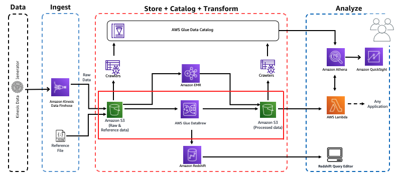

# Pre-requisites:  
Completed the previous modules   
* Ingest and Storage [link](../modules/ingest.md)
* Catalog Data [link](../modules/catalog.md)

# Transform Data with AWS Glue DataBrew

## What is AWS Glue DataBrew
AWS Glue DataBrew is a new visual data preparation tool that makes it easy for data analysts and data scientists to clean and normalize data to prepare it for analytics and machine learning. You can choose from over 250 pre-built transformations to automate data preparation tasks, all without the need to write any code. You can automate filtering anomalies, converting data to standard formats, and correcting invalid values, and other tasks. After your data is ready, you can immediately use it for analytics and machine learning projects. You only pay for what you use - no upfront commitment.

In this lab, We will do the same ETL process like 
[Transform Data with AWS Glue](../modules/transform_glue.md)

But This time We will leverage visual graphical interface in AWS Glue DataBrew!

## Learning outcomes from this workshop?
Use AWS Glue DataBrew, to visual data preparation tool that makes it easy for data analysts and data scientists to clean and normalize data to prepare it for analytics and machine learning.

---
* GoTo : https://console.aws.amazon.com/databrew/home?region=us-east-1#landing
  * Click - **Create project**

* Enter project name - **AnalyticsOnAWS-GlueDataBrew**

* In Select a dataset click **New dataset**
  - In New dataset details fill in dataset name - **raw-dataset**

* In Connect to new dataset
  - select **All AWS Glue tables** , you should see all databases in AWS glue catalog
  

* Click **analyticsworkshopdb** 
  - choose **raw** table

  
* In Permissions
  - click **Create new IAM role** in Role name
  - Fill New IAM role suffix **AnalyticsOnAWS-GlueDataBrew**
  - click **Create project**

* You should able to see like in the screenshot below:

* Click **SCHEMA** tab to explore table schema such as column name, data type, data quality, value distribution, and box plot for numeric value for data exploration

* Click **GRID** tab to return to grid view

  * We will change track_id data type, by click **#** in **track_id** column, and choose **string** type as following screenshot

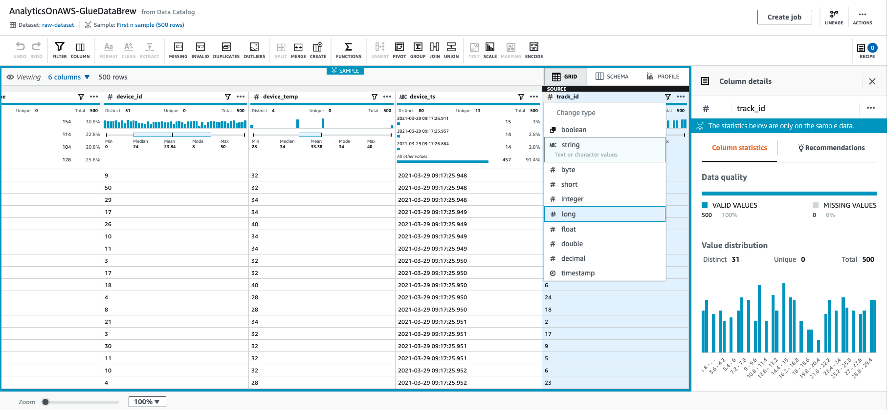

* Click **PROFILE** tab, and click **Run data profile**

  
* Leave **Job name**, and **Job run sample** as default option

* Specific s3 location for job output settins to your bucket name **s3://<yourname>-analytics-workshop-bucket/**

* **Role name** choose the existing that you have created in previous step

* Click **Create and run job**

* You should get similar in the screenshot below, Glue Databrew has started profiling your data

* Click **GRID** tab to return to grid view

* Click **Join**

* Click **Connect new dataset**

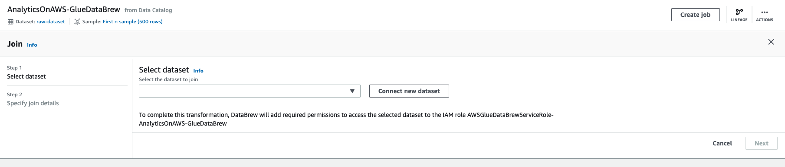

* Click **All AWS Glue tables**, and click **analyticsworkshopdb**

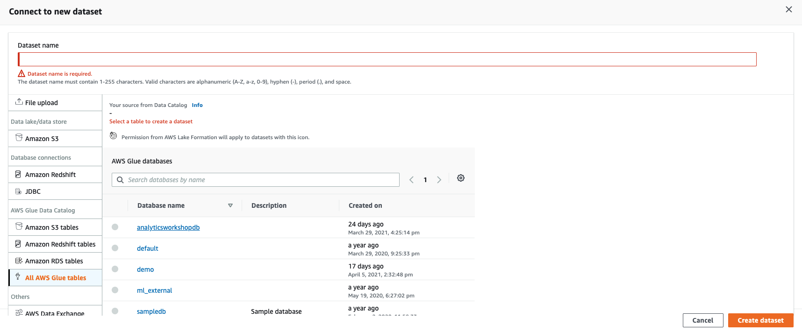

* Click **reference_data**

* Dataset name - **reference-data-dataset**

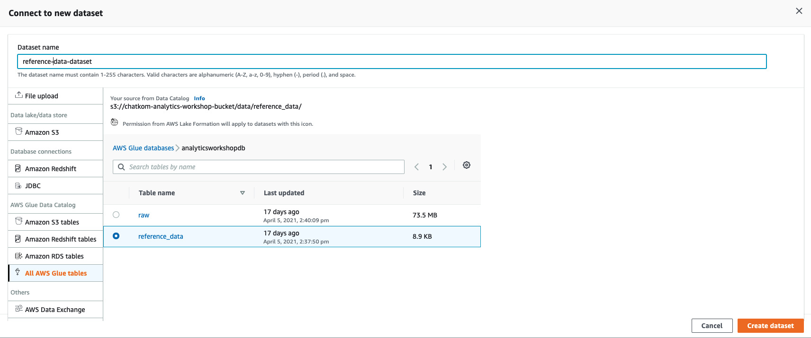

* You should see similar screenshot as below, click **Next**  
  
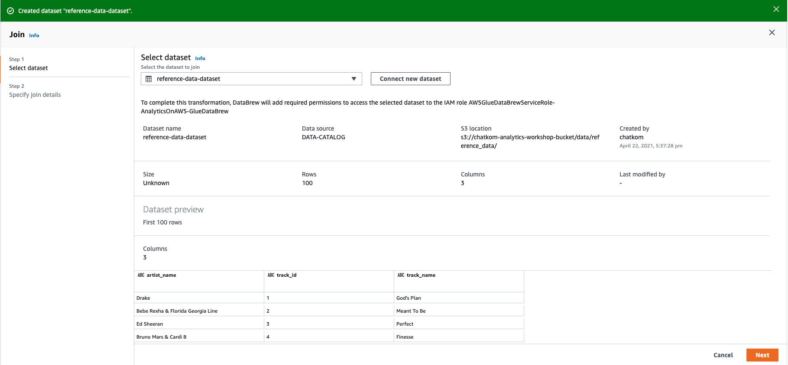

* Select **track_id** from **raw-dataset**

* Select **track_id** from **reference-data-set**

* Deselect **track_id** from **Table B**

* Click **Finish**

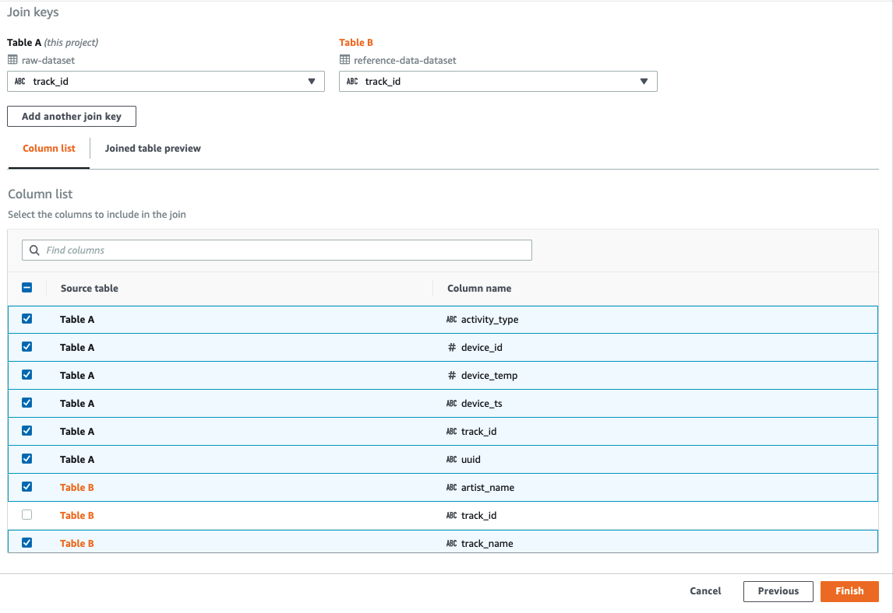

* You should result like the screenshot below:
  
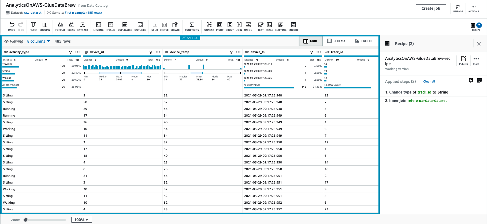

* Click **PROFILE"** to review your raw dataset profiling result such as summary, missing cells, duplicate rows, correlations, value distribution, and columns statistics, it will give you opportunities to understand more about your data

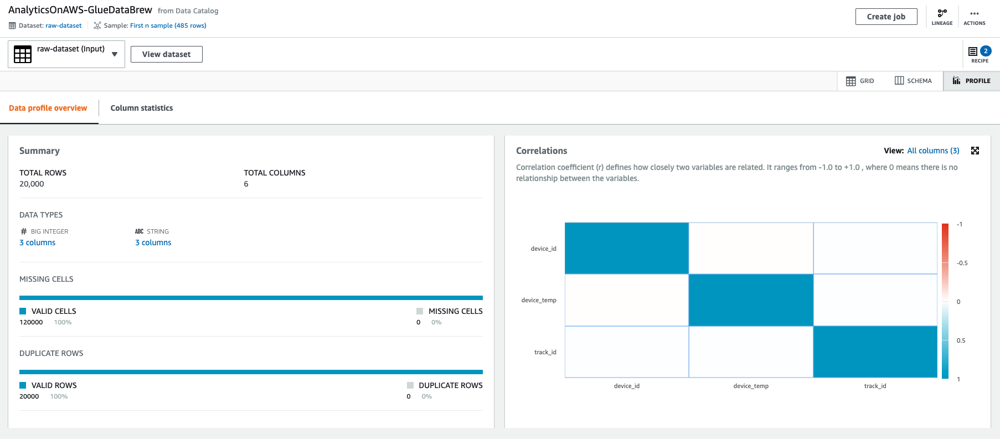

* Click **LINEAGE** on the top right corner 

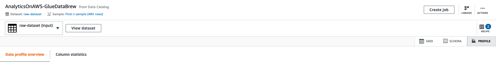

* You should able to data lineage, which is visually map the lineage of your data to understand the various data sources and transformation steps that the data has been through
   
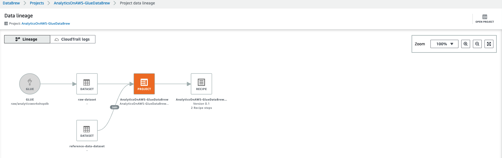

* Back to grid view, and click **Create Job**

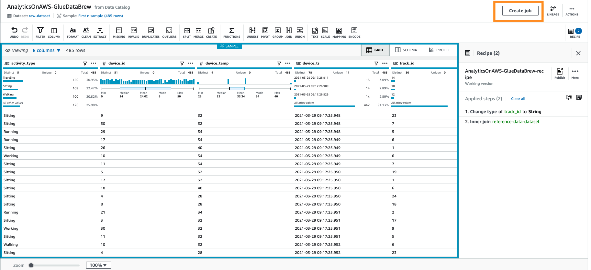

* Fill in follow value:
  - In **Job details**
    - Job name - **AnalyticsOnAWS-GlueDataBrew-Job
  - In **Job output settings**
    - File type - **GlueParquet**
    - S3 location - **s3://<yourname>-analytics-workshop-bucket/data/processed-data/**

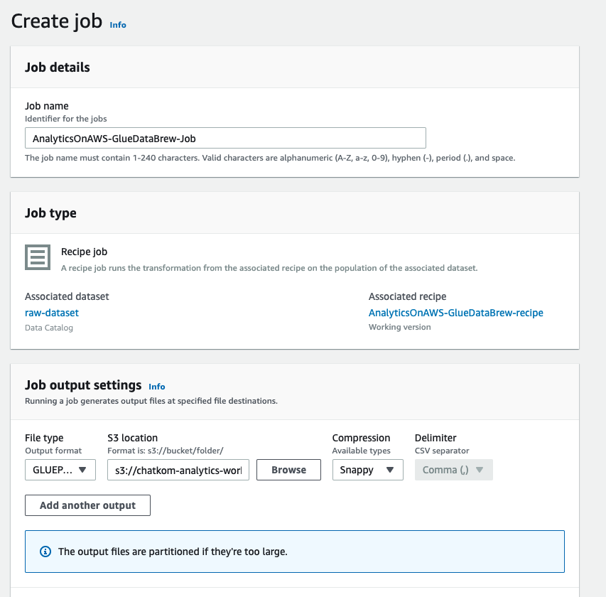   

* * Scroll down to **Permission**, and choose role name that you have created in first step, and click **Create and run job**

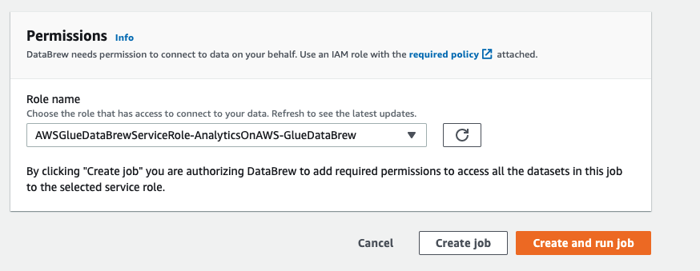

* You should see 1 job in progress

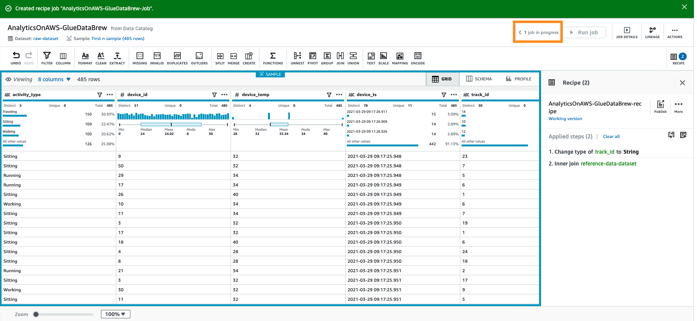

* Cick **Jobs** on the left menu, you should see following screenshot, then click **Job name** (Hyperlink) 

 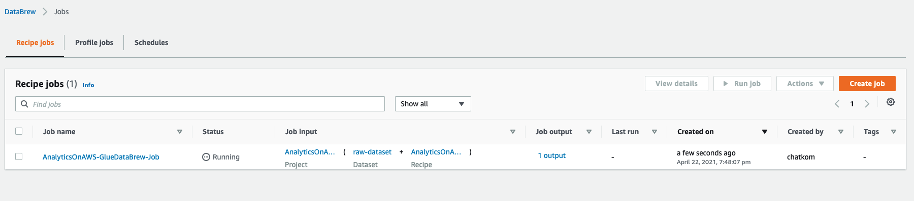

* Here you can explore job run history, job detail, and data lineage like in the screeshot below:

 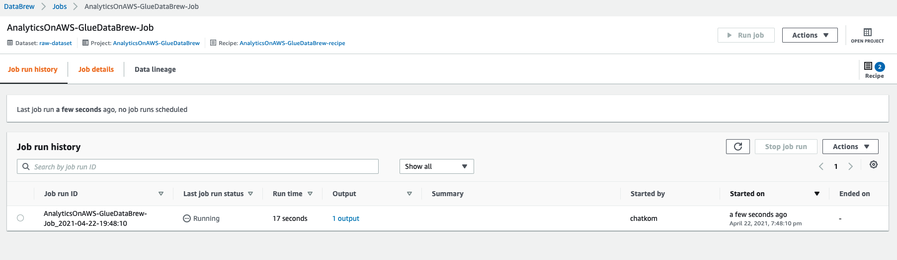

 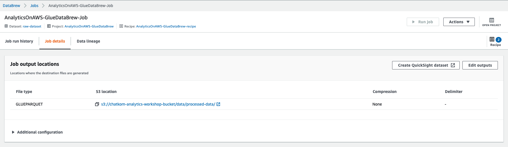

 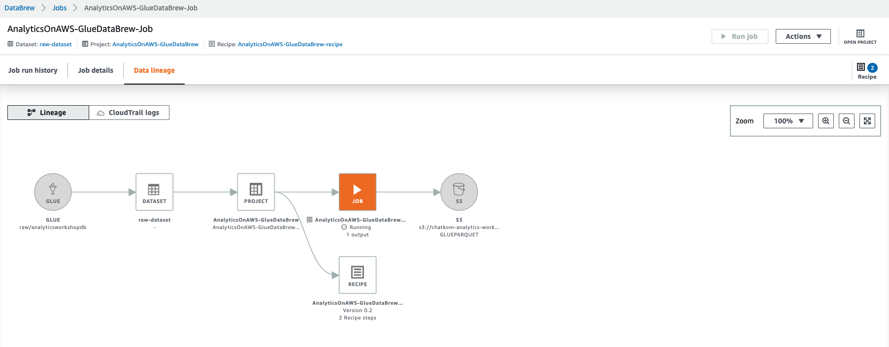

* This job should take around 4-5 minutes to be completed, you should able to see the **Succeeded** status, and click **1 output**

 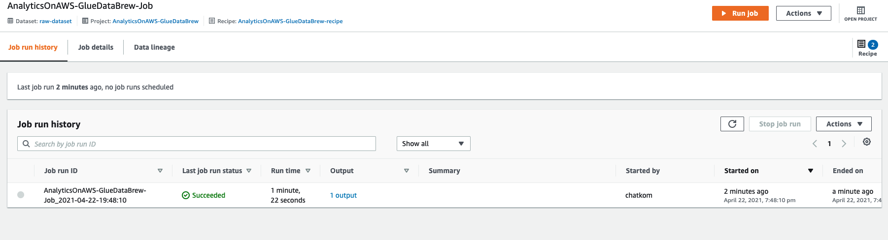

* You should be able to see output destination in **Destination** Column, click hyperlink on this column

 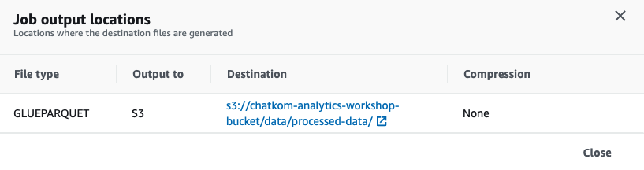

* You should see output file from Glue Databrew job!

 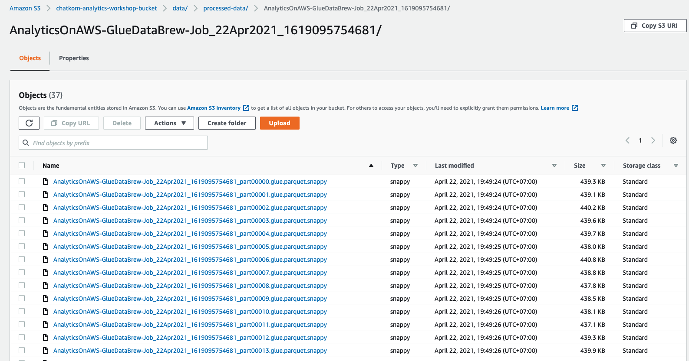

* Well Done!! You have finished Extra ETL lab with Glue DataBrew. With AWS Glue DataBrew You can choose from over 250 pre-built transformations to automate data preparation tasks, all without the need to write any code!
	
> Back to [main page](../readme.md)