# Workshop: Analytics on AWS

Contributors:

* Vikas Omer | Amazon Web Services | [Linkedin](https://www.linkedin.com/in/vikas-omer/)
* Aneesh Chandra PN | Amazon Web Services | [Linkedin](https://www.linkedin.com/in/aneesh-chandra-pn/)
* Chatchai Komrangded | Amazon Web Services | [Linkedin](https://www.linkedin.com/in/chatchaikomrangded/)

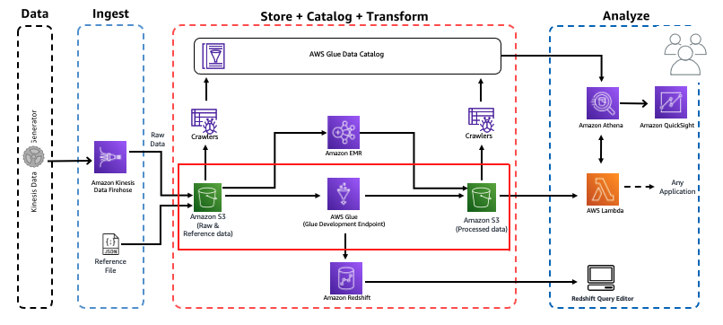

# Pre-requisites:  
Completed the previous modules   
* Ingest and Storage [link](../modules/ingest.md)
* Catalog Data [link](../modules/catalog.md)

# Transform Data with AWS Glue DataBrew

## What is AWS Glue DataBrew
AWS Glue DataBrew is a new visual data preparation tool that makes it easy for data analysts and data scientists to clean and normalize data to prepare it for analytics and machine learning. You can choose from over 250 pre-built transformations to automate data preparation tasks, all without the need to write any code. You can automate filtering anomalies, converting data to standard formats, and correcting invalid values, and other tasks. After your data is ready, you can immediately use it for analytics and machine learning projects. You only pay for what you use - no upfront commitment.

In this lab, We will do the same ETL process like 
[Transform Data with AWS Glue](../modules/transform_glue.md)

But This time We will leverage visual graphical interface in AWS Glue DataBrew!

## Learning outcomes from this workshop?
Use AWS Glue DataBrew, to visual data preparation tool that makes it easy for data analysts and data scientists to clean and normalize data to prepare it for analytics and machine learning.

---
* GoTo : https://console.aws.amazon.com/databrew/home?region=us-east-1#landing
  * Click - **Create project**

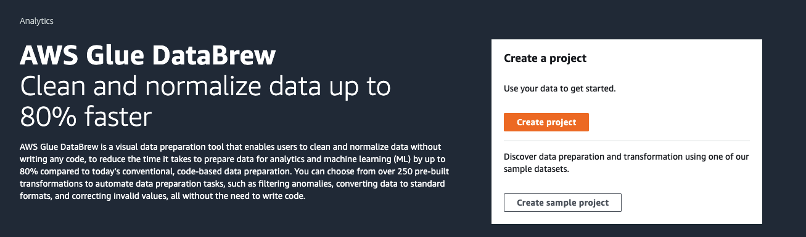

* Enter project name - **AnalyticsOnAWS-GlueDataBrew**

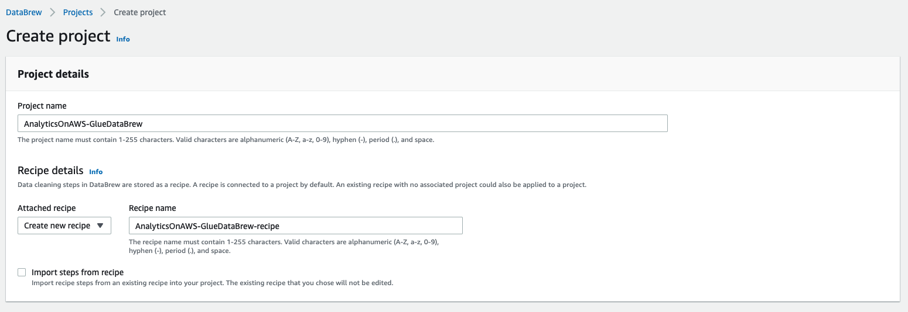

* In Select a dataset click **New dataset**
  - In New dataset details fill in dataset name - **raw-dataset**

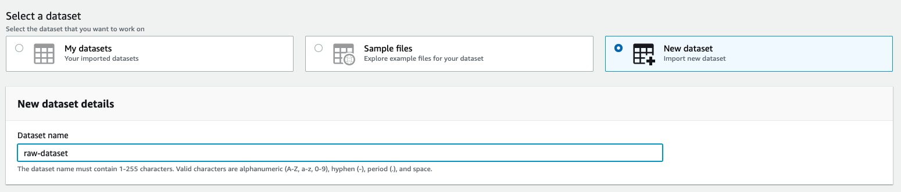

* In Connect to new dataset
  - select **All AWS Glue tables** , you should see all databases in AWS glue catalog
  
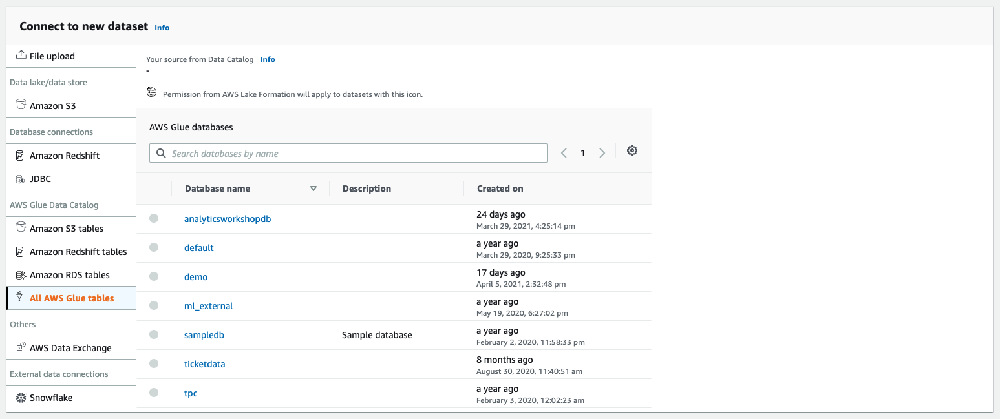

* Click **analyticsworkshopdb** 
  - choose **raw** table

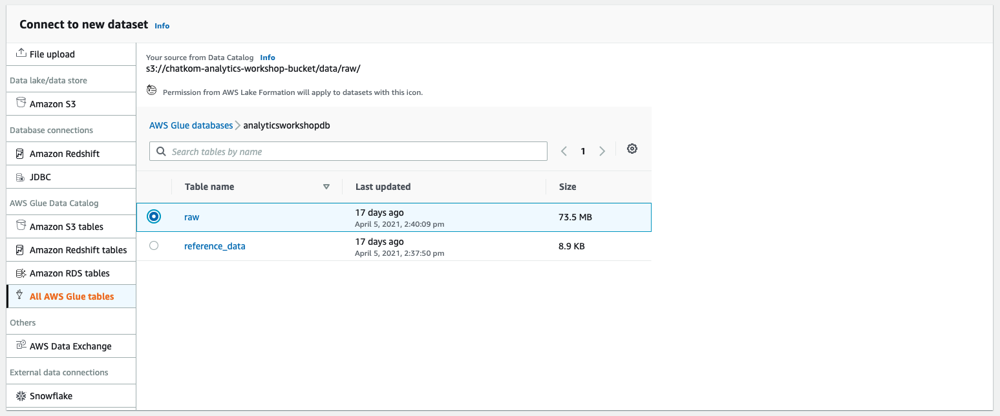
  
* In Permissions
  - click **Create new IAM role** in Role name
  - Fill New IAM role suffix **AnalyticsOnAWS-GlueDataBrew**
  - click **Create project**

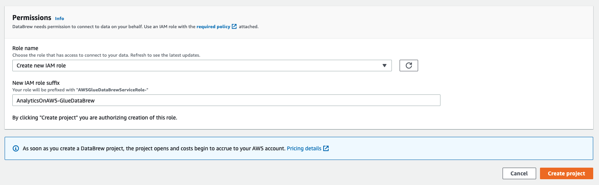

* You should able to see like in the screenshot below:

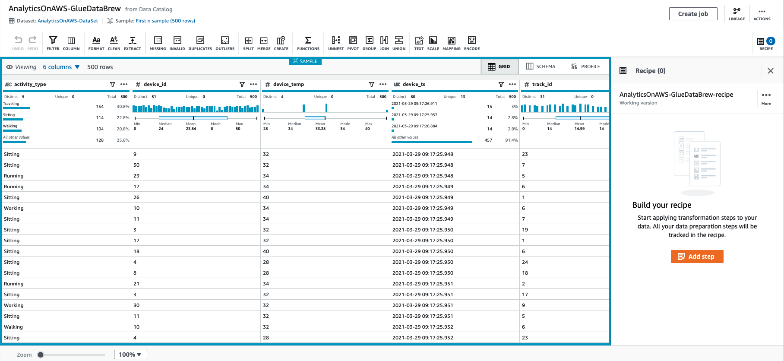

* Click **SCHEMA** tab to explore table schema such as column name, data type, data quality, value distribution, and box plot for numeric value for data exploration

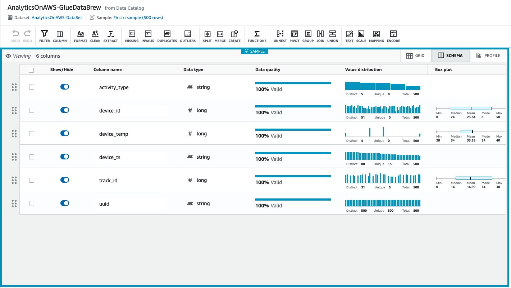

* Click **PROFILE** tab, and click **Run data profile**

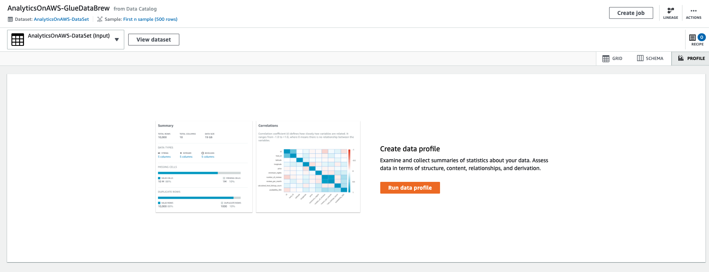
  
* Leave **Job name**, and **Job run sample** as default option

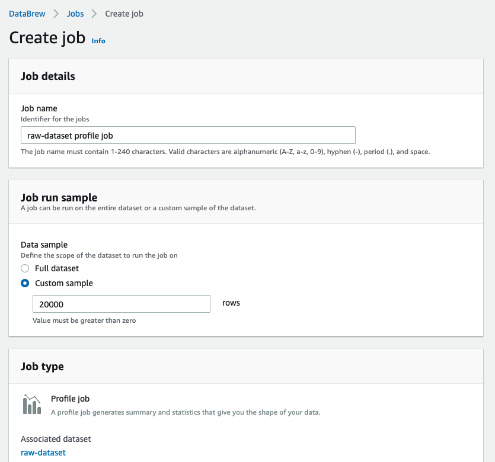

* Specific s3 location for job output settins to your bucket name **s3://<yourname>-analytics-workshop-bucket/**

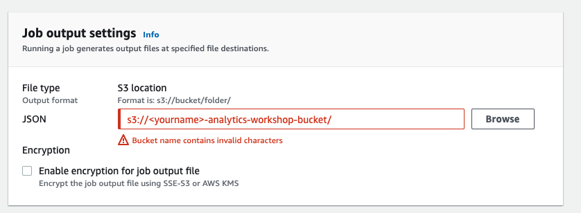

* **Role name** choose the existing that you have created in previous step

* Click **Create and run job**

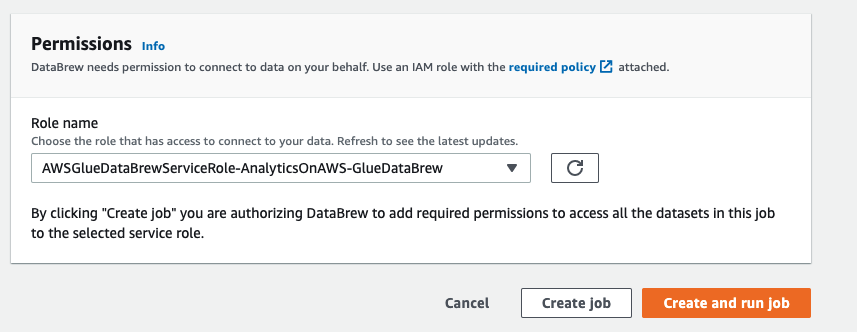

* You should get similar in the screenshot below, Glue Databrew has started profiling your data

* Click **GRID** tab to return to grid view

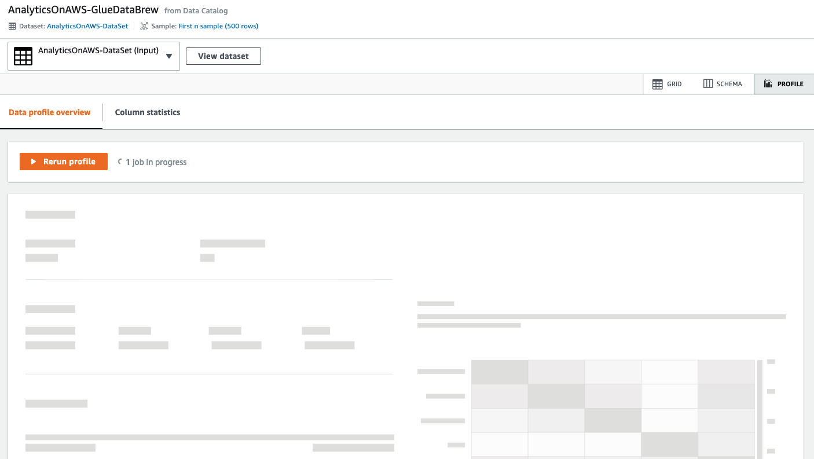

* Click **Join**

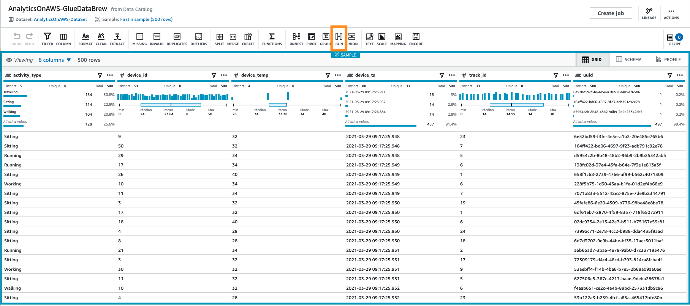

* Use **track_id** for join columns like screenshot below.

* In Join node Click **Transform** and Choose **ApplyMapping**

* You should get the output like below screenshot

* We will drop unused columns, and Mapping new data type for following columns:
    * Drop Columns
      * .track_id
      * parition_0
      * parition_1
      * parition_2
      * parition_3
    * Mapping New Data Type  
      * track_id **string** 

* You Output should match with below screenshot    
  

* Click **Transform - ApplyMapping** node
  

* Click **Target** and Choose **S3**
  

* In Data target properties - S3 Fill up the information as below:
    * Format **Glue Parquet**
    * Compression Type **Snappy**
    * S3 Target Location **s3://yourname-analytics-workshop-bucket/data/processed-data2/**
    * Data Catalog update options
      * Choose **Create a table in the Data Catalog and on subsequent runs, update the schema and add new partitions**
      * Database **analyticsworkshopdb**
      * Table name **processed-data2**

* Click **Job details** and configure with following option
   * Name **AnalyticsOnAWS-GlueStudio**
   * IAM Role **AWSGlueServiceRoleDefault**
   * Number of workers **2**
   * Job bookmark **Disable**
   * Number of retries **1**
   * Job timeout (minutes) **10**
   * Leave the rest as default value
   * Click **Save**
   

* Click **Save** and You should see "Successfully created job", You can start ETL job by Click **Run** 
   

* You should see "Successfully started job", then Click **Run Details** to Monitor your ETL job
   

* You should see your ETL job Run Status "Succeeded" as below screenshot

* You can see Pyspark Code that Glue studio generated, It's whitebox concept that help you to understand what's behide the scence, and you can also reuse this code for other purpose.

* Go To Glue DataCatalog: https://console.aws.amazon.com/glue/home?region=us-east-1#

* Well Done!! You have finished Extra ETL lab with GlueStudio. With AWS Glue Studio You can visually compose data transformation workflows and seamlessly run them on AWS Glue’s Apache Spark-based serverless ETL engine.

* Bonus Knowledge, You can use Glue to get data from 3rd party data source from AWS Marketplace. You can click to get start from AWS Glue studio for Example **AWS Glue Connector for Google BigQuery**

* In AWS Glue Studio Click **Marketplace**

https://aws.amazon.com/blogs/big-data/migrating-data-from-google-bigquery-to-amazon-s3-using-aws-glue-custom-connectors/
	
> Back to [main page](../readme.md)