# Workshop: Analytics on AWS

Contributors:

* Vikas Omer | Amazon Web Services | [Linkedin](https://www.linkedin.com/in/vikas-omer/)
* Aneesh Chandra PN | Amazon Web Services | [Linkedin](https://www.linkedin.com/in/aneesh-chandra-pn/)
* Chatchai Komrangded | Amazon Web Services | [Linkedin](https://www.linkedin.com/in/chatchaikomrangded/)

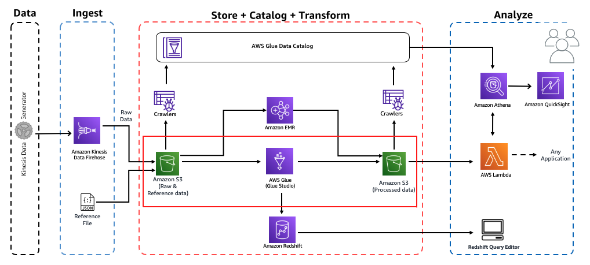

# Pre-requisites:  
Completed the previous modules   
* Ingest and Storage [link](../modules/ingest.md)
* Catalog Data [link](../modules/catalog.md)

# Transform Data with AWS Glue Studio

## What is AWS Glue Studio?
AWS Glue Studio is a new graphical interface that makes it easy to create, run, and monitor extract, transform, and load (ETL) jobs in AWS Glue. You can visually compose data transformation workflows and seamlessly run them on AWS Glue’s Apache Spark-based serverless ETL engine.

In this lab, We will do the same ETL process like [Transform Data with AWS Glue](../modules/transform_glue.md)

But This time We will leverage visual graphical interface in AWS Glue Studio!

## Learning outcomes from this workshop?
Use AWS Glue Data Studio, a graphical interface that makes it easy to create, run, and monitor extract, transform, and load (ETL) jobs in AWS Glue.

---
* Goto : https://console.aws.amazon.com/gluestudio/home?region=us-east-1
  * Click - **hamberger** icon in the left to expand menu

  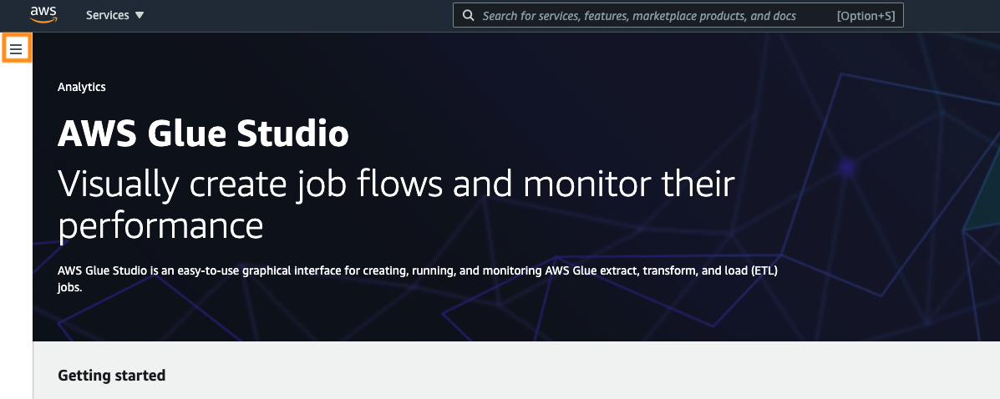
  
  * Click - **job** and choose **blank graph**

  * Click **create**

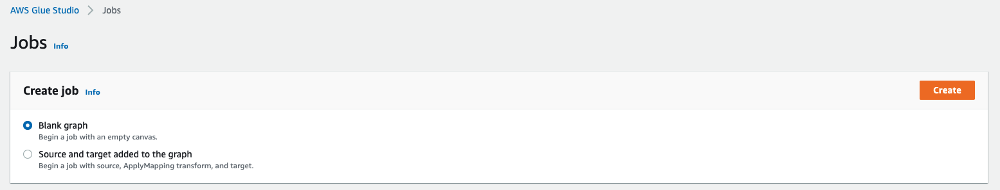

* Click - **Source** and choose - **S3**

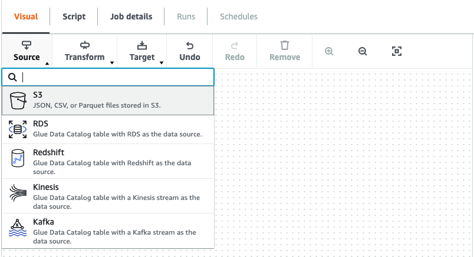

  * click tab **Data source properties - S3**
  * in S3 source type choose **Data Catalog table** 
  * choose following value
      * database - **analyticsworkshopdb**
      * table - **raw**
  
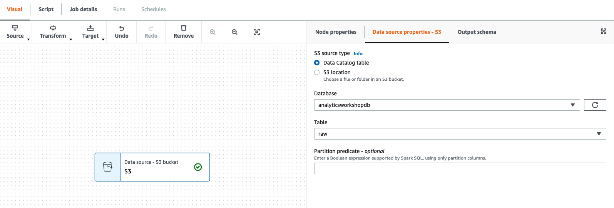

* Repeat the same step and click - **Source** and Choose - **S3**

* Click tab **Data source properties - S3**
* In S3 source type choose **Data Catalog table** 
* Choose following value
    * database - **analyticsworkshopdb**
    * table - **reference_data**
  
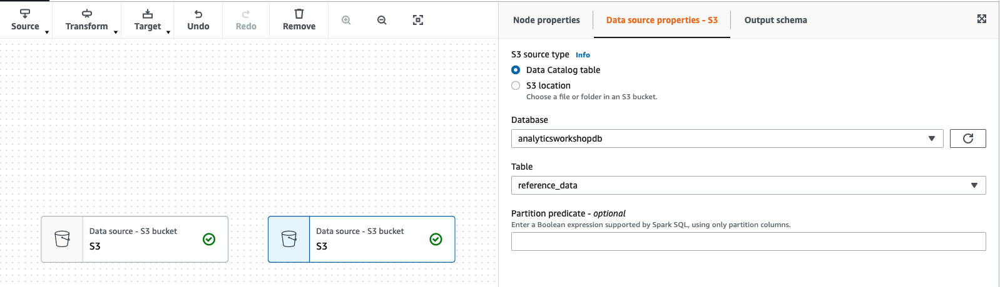

* Click node either on the left, or right

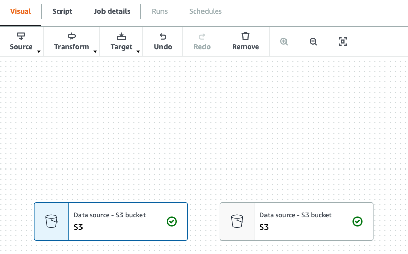

* Click **Transform** and choose **Join**

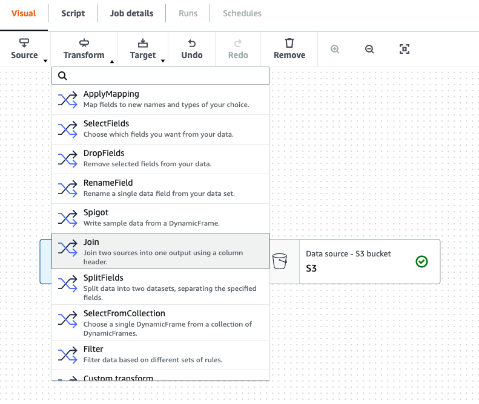

* You should get the visual diagram like in the screenshot below, and message on the right "Insufficient source nodes" because you need another node (Data source) to join

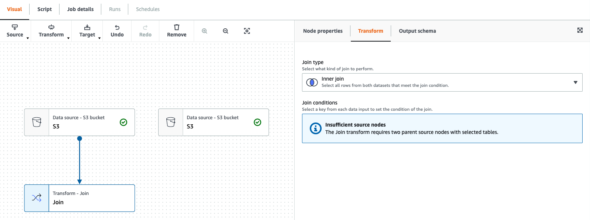

* Next click on **Transform - Join node**, >> next, click on Transform - Join node, and on **Node properties**, select dropdown list and tick all S3 data source as depicted in the screenshot below:
  
  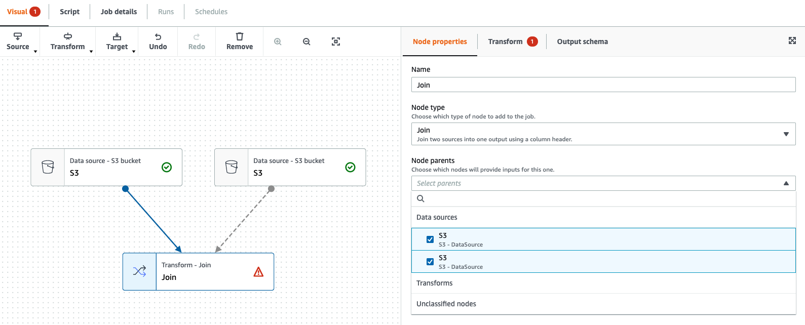

  - click **Transform tab** in Join Node
  
  - click **Add condition**

  - use **track_id column** for join columns in the screenshot below.

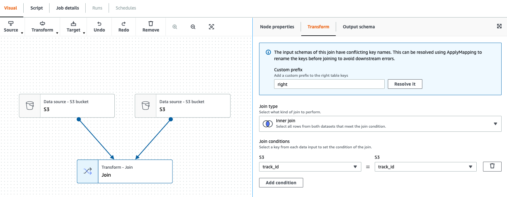

* In Join node click **Transform** and choose **ApplyMapping**

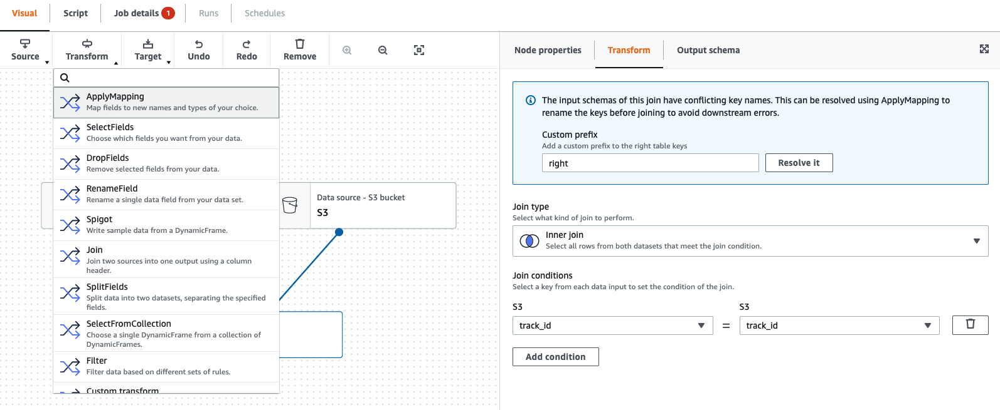

* You should get the visual diagram like in the screenshot below

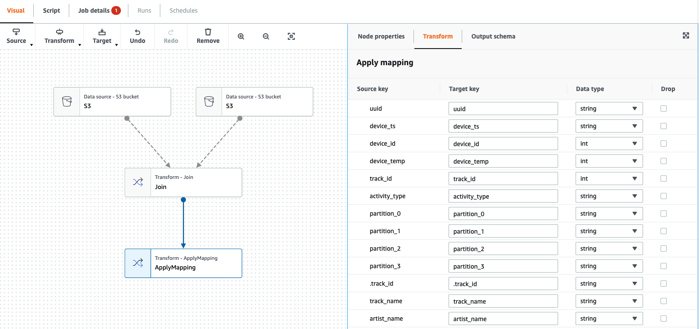

* We will drop unused columns, and mapping new data type for following columns:
    * drop Columns
      * .track_id
      * parition_0
      * parition_1
      * parition_2
      * parition_3
    * pping New Data Type  
      * track_id **string** 

* You output should match like in the screenshot below   
  
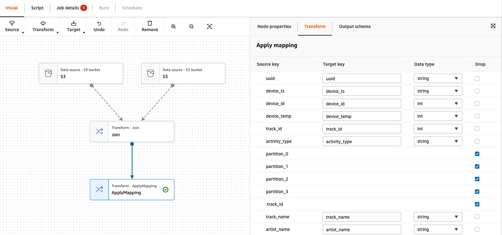

* Click **Transform - ApplyMapping** node
  
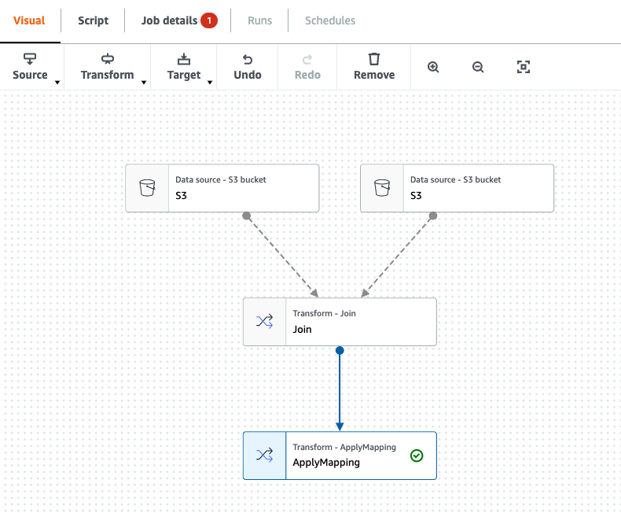

* Click **Target** and choose **S3**
  
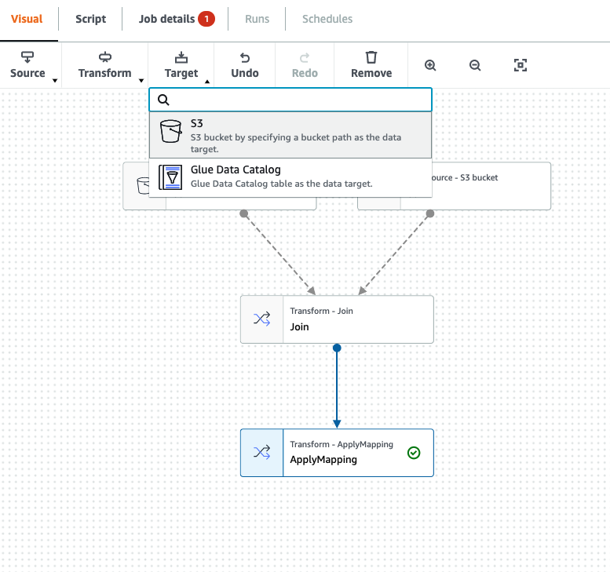

* In data target properties - S3 fill up the information as below:
    * Format **Glue Parquet**
    * Compression Type **Snappy**
    * S3 Target Location **s3://yourname-analytics-workshop-bucket/data/processed-data2/**
    * Data Catalog update options
      * Choose **Create a table in the Data Catalog and on subsequent runs, update the schema and add new partitions**
      * Database **analyticsworkshopdb**
      * Table name **processed-data2**

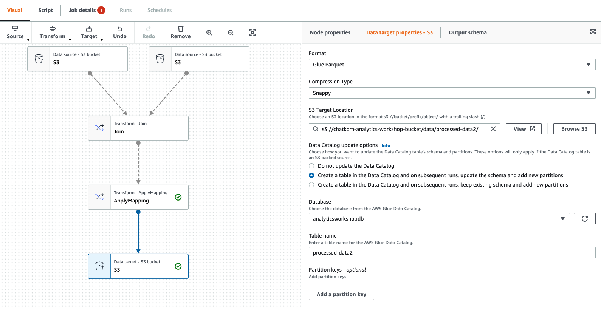

* Click **Job details** and configure with following option
   * Name **AnalyticsOnAWS-GlueStudio**
   * IAM Role **AWSGlueServiceRoleDefault**
   * Number of workers **2**
   * Job bookmark **Disable**
   * Number of retries **1**
   * Job timeout (minutes) **10**
   * Leave the rest as default value
   * Click **Save**
   
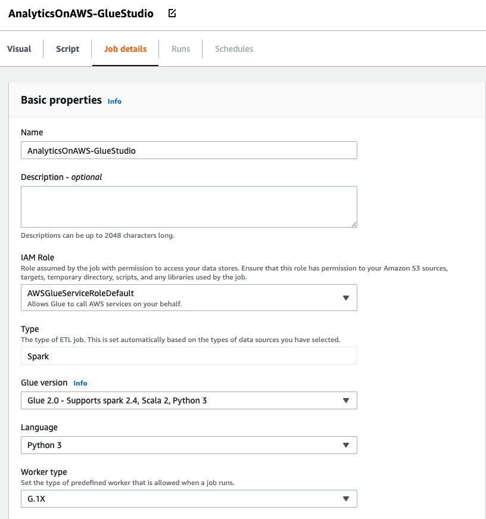

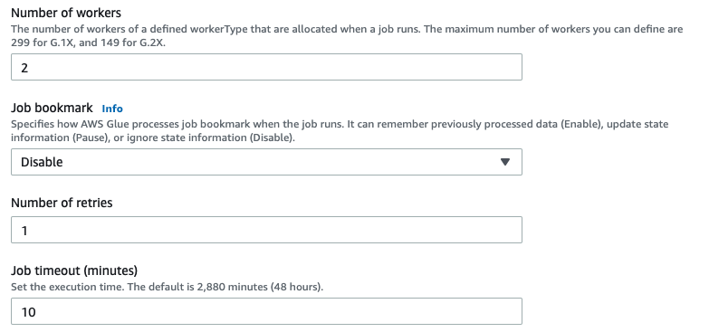

* Click **Save** and you should see "Successfully created job", You can start ETL job by Click **Run** 
   
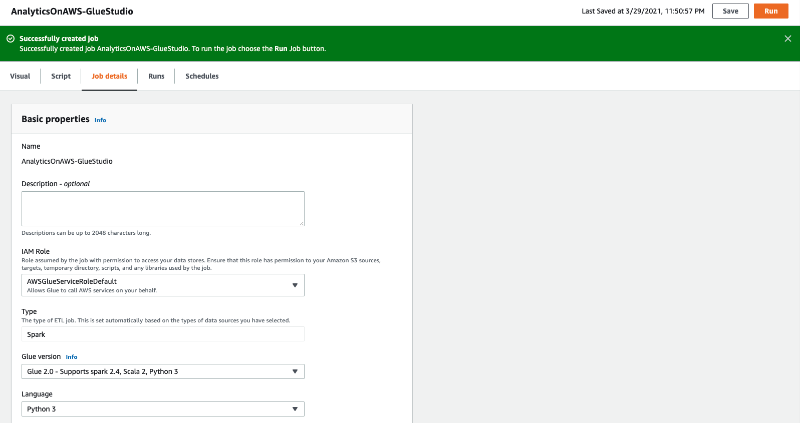

* You should see "Successfully started job", then click **Run Details** to monitor your ETL job
   
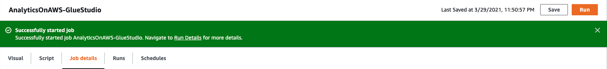

* You should see your ETL job Run Status "Succeeded" like in the screenshot below

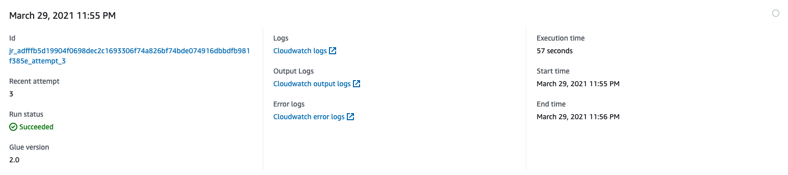

* You can see Pyspark Code that Glue studio has generated, It's whitebox concept that help you to understand what's behide the scence, and you can also reuse this code for other purposes.

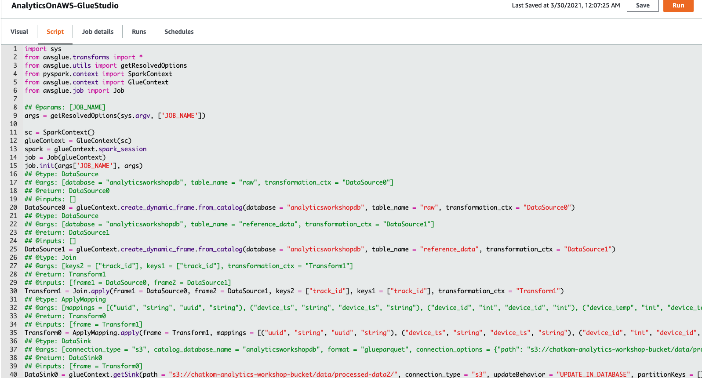

* Go To Glue DataCatalog: https://console.aws.amazon.com/glue/home?region=us-east-1#

* Well Done!! You have finished extra ETL lab with GlueStudio. With AWS Glue Studio You can visually compose data transformation workflows and seamlessly run them on AWS Glue’s Apache Spark-based serverless ETL engine.

* Bonus Knowledge, You can use GlueStudio to get data from 3rd party data source from AWS Marketplace. You can click to get start from AWS Glue studio for Example **AWS Glue Connector for Google BigQuery**

* In AWS Glue Studio Click **Marketplace**

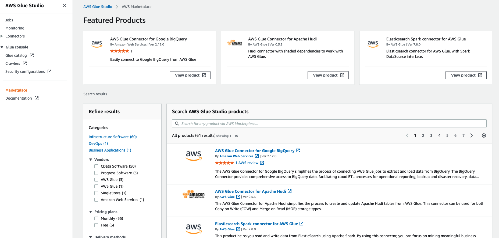

https://aws.amazon.com/blogs/big-data/migrating-data-from-google-bigquery-to-amazon-s3-using-aws-glue-custom-connectors/
	
> Back to [main page](../readme.md)