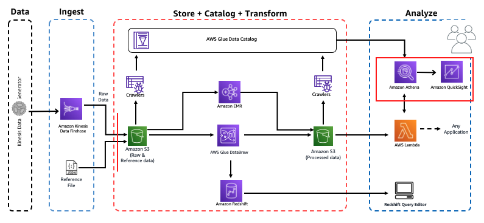
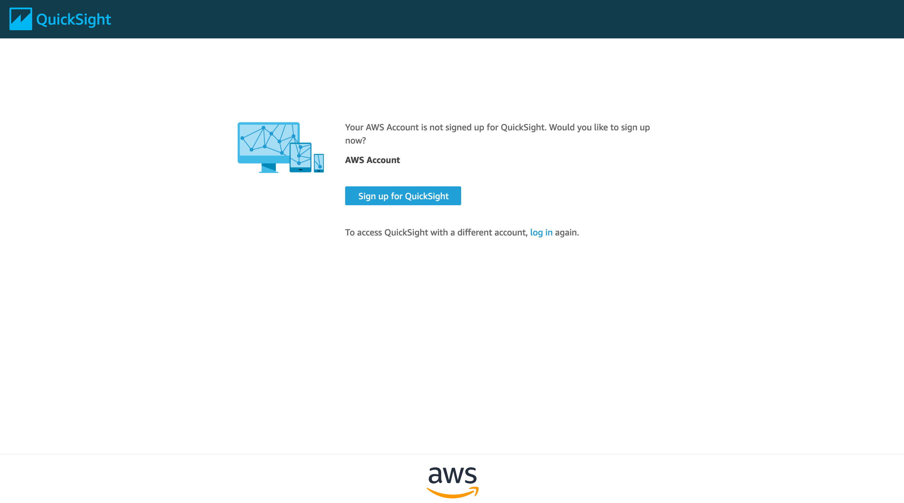
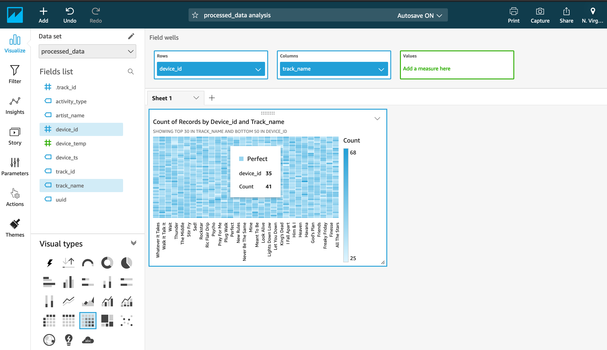

# Workshop: Analytics on AWS

Contributors:

* Vikas Omer | Amazon Web Services | [LinkedIn](https://www.linkedin.com/in/vikas-omer/)
* Aneesh Chandra PN | Amazon Web Services | [LinkedIn](https://www.linkedin.com/in/aneesh-chandra-pn/)

# Pre-requisites:  
Complete the previous modules:  
* Ingest and Storage [link](../modules/ingest.md)
* Catalog Data [link](../modules/catalog.md)
* Transform Data with AWS Glue [link](../modules/transform_glue.md)

# Visualize

## Setting Up QuickSight
In this step we will visualize our processed data using QuickSight.

* Go to: https://us-east-1.quicksight.aws.amazon.com/en/start

* Click **Sign up for QuickSight**
* Ensure Enterprise is selected and click **Continue**
* QuickSight account name: **yournameanalyticsdemo**
* Notification email address: **you@youremail.com**
* Select **Amazon Athena** - this enables QuickSight access to Amazon Athena databases
* Select **Amazon S3**
	* Select **yourname-analytics-demo-bucket**
	* Click **Finish**
* Click **Finish**
* Wait for your QuickSight account to be created

## Adding a New Dataset

* Go to: https://us-east-1.quicksight.aws.amazon.com/en/start
* On top right, click **Manage Data**
    * Click **New Data Set**
    * Click **Athena** 
    * New Athena data source
        * Data source name: **analyticsdemo**
        * Click **Validate connection**
            * This will check if your QuickSight can access Athena
        * Click **Create data source**
    * Choose your table:
        * Database: contain sets of tables - select **analyticsdemodb**
        * Tables: contain the data you can visualize - select **processed_data**
        * Click **Select**
    * Finish data set creation:
        * Select **Directly query your data**
        * Click **Visualize**

## Using Amazon Quick Sight to Visualize Our Processed Data

### Visualization 1: Heat map of users and tracks they are listening to

In this step, we will create a visualization that show us which users are listening to repetitive tracks

* On the bottom-left panel (**Visual types**):
    * Hover on icons there to see names of the available visualizations
    * Click on **Heat Map**
* On top-left panel (**Fields list**)
    * Click **device_id**
    * Click **track_name**
* Just above the visualization you should see **Field wells**: **Rows: device_id** | **Columns: track_name**

If you hover on dark blue patches on the heatmap you will see that those particular users are listening to the same track repeatedly.

### Visualization 2: Tree map of most played Artist Names

In this step we will create a visualization that shows which are the most-played artists.

* On the top-left, click '**+ Add**' > **Add Visual**. This will add a new panel to the right pane
* On the bottom-left panel (**Visual types**):
    * Hover on icons there to see names of the visualizations
    * Click **Tree Map**
* On the top-left panel (**Fields list**):
    * Click **artist_name**

Play around and explore the Amazon QuickSight Console. Try out filters, other visualization types, etc.

Back to [main page](../readme.md)